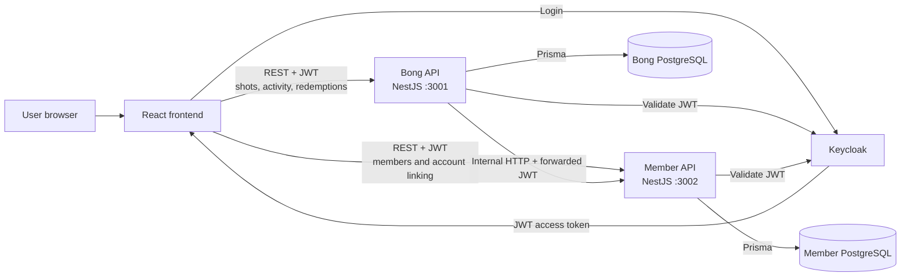
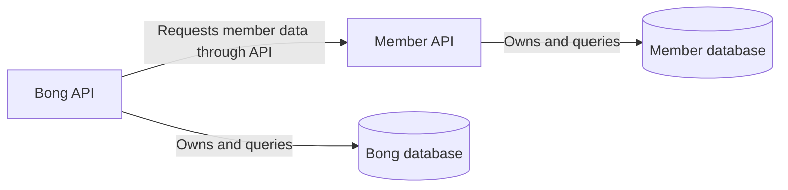
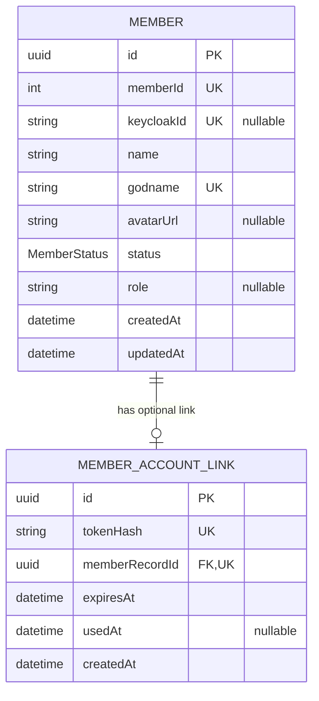
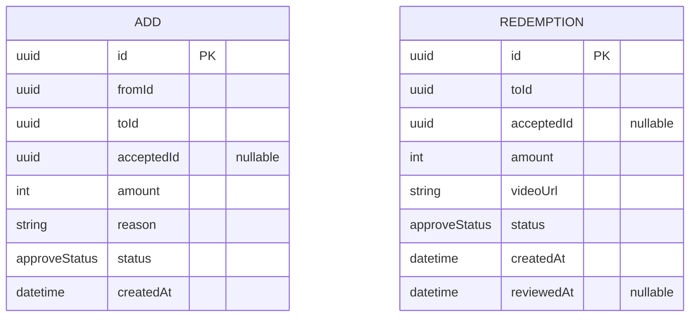
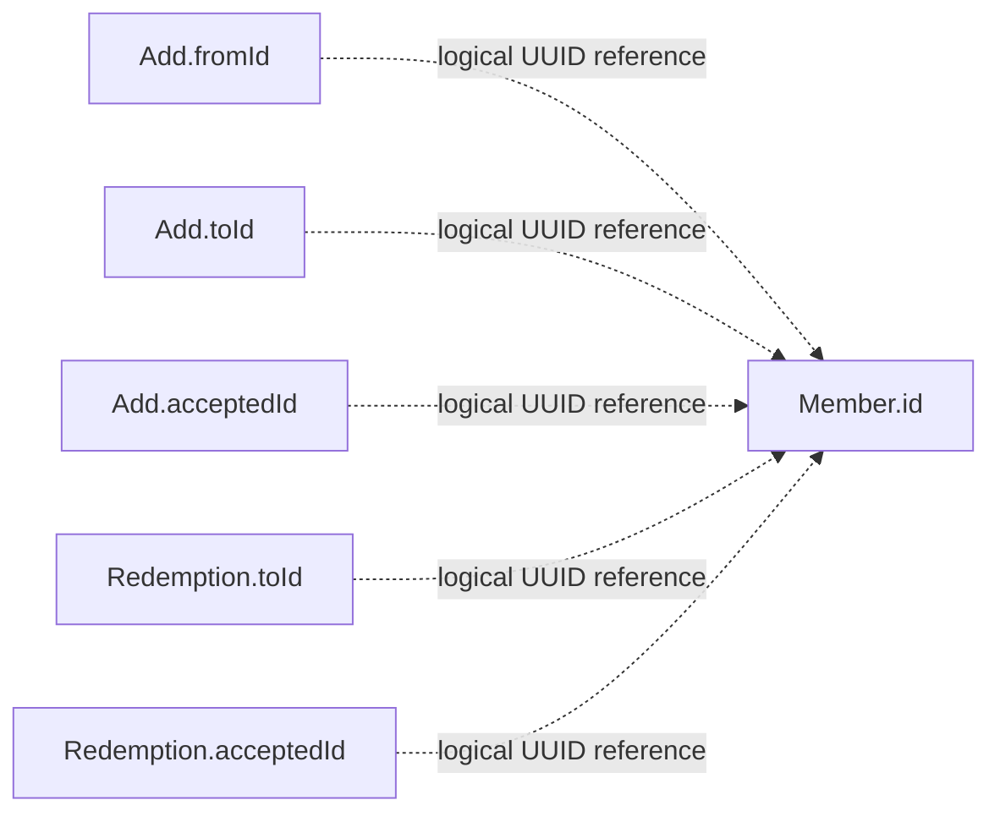
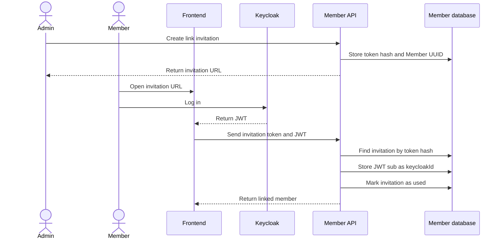
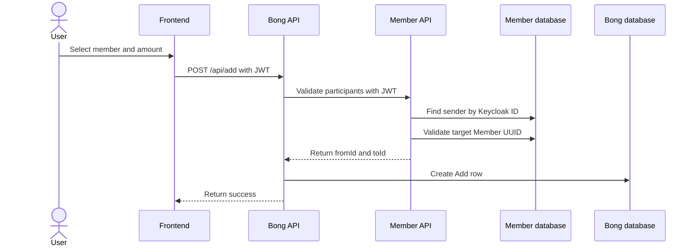

# Valhall Architecture

This document describes the current services and databases used by Valhall.

## Services



### Frontend

The React frontend provides the user interface and authenticates users through Keycloak.

It communicates with the backend services using REST and JSON.

### Bong API

The Bong API manages:

- Adding bongar
- Recent activity
- Redemptions
- Validation of shot senders and recipients through the Member API

The service owns the Bong PostgreSQL database.

### Member API

The Member API manages:

- Member records
- Member statuses and roles
- Keycloak account connections
- Account-link invitations
- Shot-target validation
- Resolving member UUIDs to names

The service owns the Member PostgreSQL database.

### Service communication

The Bong API currently communicates with the Member API using internal HTTP requests.

The authenticated user's JWT is forwarded in the `Authorization` header so the Member API can validate the request.

```http
Authorization: Bearer <token>
```

The services may use gRPC for internal communication in the future, but gRPC is not currently implemented.

## Databases

Valhall currently uses two separate PostgreSQL databases.

Each microservice owns its database. A service should not query another service's database directly.



## Member database



### Member

`Member.id` is the internal UUID used to identify a member across services.

`Member.memberId` is an automatically incremented member number.

`Member.keycloakId` stores the Keycloak `sub` value after a member connects their account. It remains `NULL` until the account is connected.

Possible member statuses are:

- `VIKING`
- `GUD`
- `AS`

### MemberAccountLink

`MemberAccountLink` stores temporary account-link invitations.

The raw invitation token is not stored. Only its SHA-256 hash is saved in `tokenHash`.

Each member can have at most one current account-link record because `memberRecordId` is unique.

Deleting a member also deletes its account-link record.

## Bong database



Possible approval statuses are:

- `PENDING`
- `APPROVED`
- `DENIED`

### Add

An `Add` row represents bongar given from one member to another.

- `fromId` is the sender's Member UUID.
- `toId` is the recipient's Member UUID.
- `acceptedId` can store the UUID of the member who reviews the entry.
- `amount` contains the number of bongar.
- `reason` explains why they were given.

### Redemption

A `Redemption` row represents a request to redeem bongar.

- `toId` identifies the member associated with the redemption.
- `acceptedId` can identify the reviewing member.
- `amount` contains the redeemed amount.
- `videoUrl` identifies the submitted video.
- `reviewedAt` is set when the request is reviewed.

## Cross-service member references

The Bong database stores Member UUIDs, but it does not have foreign-key constraints to the Member database.



These are logical references rather than database-enforced relationships because the records live in separate PostgreSQL databases.

The Bong API asks the Member API to validate UUIDs and resolve member names. This preserves service ownership and prevents the Bong API from accessing the Member database directly.

## Account-link flow



## Adding bongar



## Planned additions

The following components are planned but are not part of the current database implementation:

- MinIO storage for redemption videos
- Redis caching for the scoreboard
- WebSockets for live activity updates
- gRPC for internal microservice communication

PostgreSQL will remain the permanent source of truth when Redis is introduced.